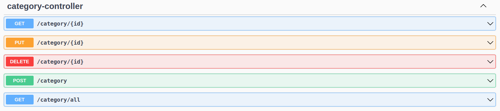
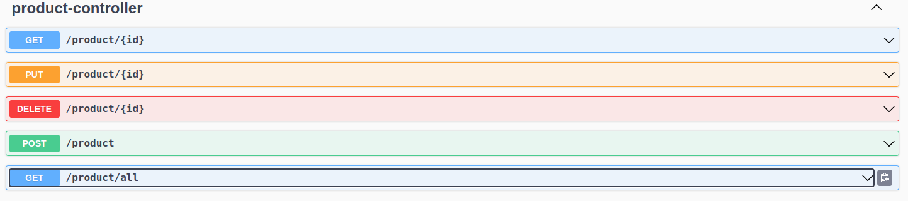
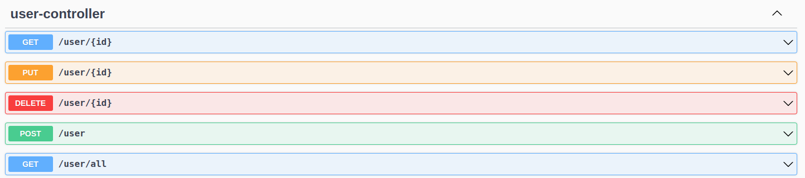
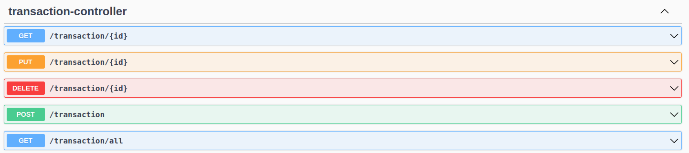

# e-lectronic

***

## Name
e-lectronic is an API for electronic product data collection

## Description
This project is a simple project to create product, category, user and transaction APIs. This project was built using the Spring Boot framework with the Java programming language and the PostgreSQL database. This project still has a deficiency, namely there is no validation for notblank, a unique entity in the category table.

## API Test Guide
Adding data to the category table, because the product table requires a category id to fill it.  
Add data to the product table  
Add data to the user table  

## Server PORT
server.port=8081

## Run the API
Using swagger  
http://localhost:8081/swagger-ui/index.html#/

or using localhost  
http://localhost:8081/(controller_name)

## The HTTP request methods allowed on each controller

